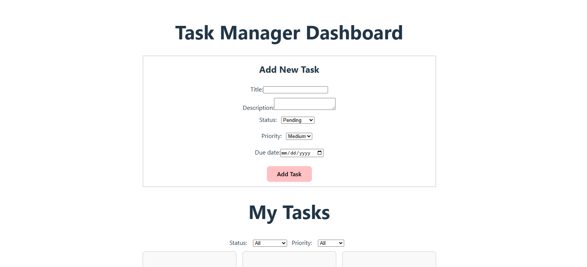

# Project Title:

Task Manager Dashboard (React + TypeScript)

# My Solution Screeshot:

# How to Use:

1. cd into your project folder in VS Code, run npm run dev  
   app will open in default browser

You can:

- Add a new task using the Task Form (title, description, status, priority, due date)
- Select a due date using the date picker
- Filter tasks by status and priority
- Update a task’s status
- Delete a task
- View tasks rendered in a row layout like a dashboard

# Challenges:

1. I struggled with organizing component responsibility at first. I originally placed most of the logic inside App.tsx, but later realized that Dashboard.tsx should own the task state, filters, and handlers. Refactoring the logic into Dashboard.tsx helped clarify component responsibilities.

2. Another challenge was managing TypeScript types across the application. I initially duplicated types such as Task and NewTaskData, which caused conflicts. I had to clean up my types file and ensure that shared types were centralized and reused correctly across components.

3. I also ran into a bug where a function was accidentally placed inside a filter callback, which caused rendering issues. Identifying where functions should live inside a component helped reinforce proper React structure.

# Reflection:

1. How you implemented React and TypeScript features

I used React functional components with hooks such as useState to manage application state. The main task logic (tasks, filters, and handlers) lives in the Dashboard component, while presentational components like TaskForm, TaskList, and TaskFilter receive data and callbacks through props.

2. Your approach to component composition and state management

I followed a top-down state management approach. The Dashboard component holds the main application state, including the list of tasks and active filters. Child components do not manage shared state; instead, they receive data and callback functions via props.

Component composition was handled by keeping each component focused on a single responsibility:

TaskForm handles collecting user input and submitting new tasks.

TaskFilter manages filter selection.

TaskList displays tasks and triggers status updates or deletions.

This approach made the components reusable, easier to test, and easier to reason about, while keeping the data flow predictable and aligned with React best practices.

# Project Requirements:

Component Implementation:

- TaskForm component for adding new tasks
- TaskList component for displaying tasks
- TaskFilter component for filtering by status and priority
- Dashboard component to manage state and logic

Component Testing:

- Manual testing through UI interactions
- Verified adding, filtering, updating, and deleting tasks works correctly

Component Composition:

- App.tsx renders Dashboard
- Dashboard composes TaskForm, TaskFilter, and TaskList
- State and handlers are lifted to Dashboard and passed down via props

Documentation:

- README includes usage instructions, challenges, and reflection

# Before Starting:

- Create a new React TypeScript project using Vite:
  npm create vite@latest task-manager -- --template react-ts

- cd task-manager
- npm install

- Create Folder Structure:
  src/  
  components/  
  Dashboard/  
  Dashboard.tsx  
  TaskForm/  
  TaskForm.tsx  
  TaskList/  
  TaskList.tsx  
  TaskFilter/  
  TaskFilter.tsx  
  types.ts  
  App.tsx
